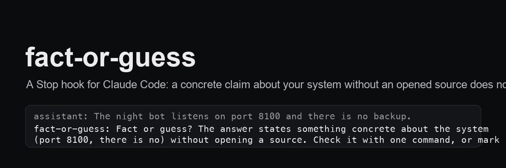

# fact-or-guess

A `Stop` hook for Claude Code. When the final answer of a turn states something concrete about your own system - a memory entry, a path, an address, "there is no X" - and no file or command was read in that turn or earlier in the session, the hook blocks the stop with one line: *fact or guess?* Verify with one command, or say it is a guess, and continue.

   

## Why

An assistant checks where it doubts and does not check where it is sure, and from the inside certainty and knowledge feel the same. A reminder "verify before answering" nudges the intention; a confident answer has no intention to verify. So this hook does not talk to the intention. It looks at the finished answer: was a source opened, or is this a recollection?

It deliberately does **not** judge whether the claim is true. A hook cannot know that, and gates that pretend to lose trust and get ignored.

## Install

```bash
git clone https://github.com/MrFreedxm/fact-or-guess.git
cp fact-or-guess/fact-or-guess.py ~/.claude/hooks/
# add the Stop hook from settings.example.json to ~/.claude/settings.json
python3 -m unittest discover -s fact-or-guess/tests
```

## What counts

| passes | blocked |
|---|---|
| any Read / Grep / Glob / Bash / WebFetch in the turn | a claim naming one of your memory entries or registry cards, without a read |
| the same entity was read earlier in this session | a path or address (`~/.claude`, `/opt/x`, an IPv4, `com.vendor.id`) without a read |
| the answer hedges: "hypothesis", "I did not check", "from memory" | "there is no X", "isn't configured", "listens on 8100" without a read |
| the answer only repeats what the user just said | |

"Entities" are the file names in your project's auto-memory directory (next to the transcript), so the hook knows the vocabulary of your system without any configuration. Override with `FACT_GATE_ENTITY_DIRS`; tune the path regex with `FACT_GATE_PATH_RE`. Every decision is logged as one jsonl line, so you can measure how often the gate fires and how often it is right.

## Stack

One Python file, standard library, no network. Exit code 2 with a message on stderr is what Claude Code reads as "do not stop yet".

Built with Claude Code and Codex, after counting how many confident wrong answers a week were recollections.

MIT © Ilya Tretyakov
